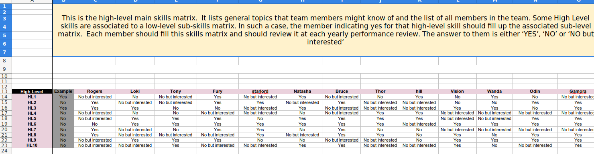
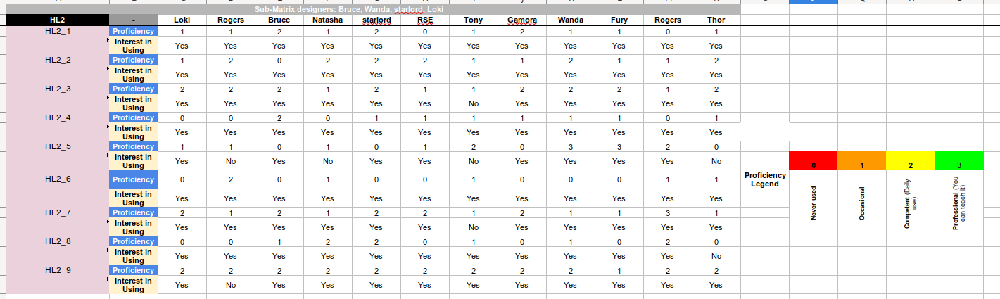

.. _Usagecli:

.. note::

   All the files used in the examples below are public and shared in the repository. They are shared in the same GPLv3 licence as the software.

Input file
==========

Neo works with spreadsheets [can be done via Google drive, Libreoffice or Excel]. The format of the spreadsheet is predefined and must be respected to make sure that Neo can read it. An example of such spreadsheed it given in the next image.

   Screenshot of the High Level sheet 

The file is organised in two types of skills matrices: the high Level one, where only general topics are present, and low level ones that corresponds to each topic of the High level one. This is where actual skills are listed. The image above show the High Level Skill Matrix. The first column [A] has the general topics list. The second column is just an example of how to fill the cells. The subsequent columns correspond to each team member. Each cell is a drop-down list with three possibilities: 'Yes', 'No' and 'No, but interested'. The latter answer being used to create the training team matrix. 

The second type of sheet you can have is a subskills matrix. In general it is associated to a line in the general HighLevel matrix. A screenshot can be seen below.

   Screenshot of a subskill matrix

In this submatrix, the first line gives an indication of who designed it. This line is not part of the skills matrix. When reading the sheet neo will start at line 2 (see :doc:`usage`). The first column ['A'] contains the list of skills while the second column ['B'] gives, for each skill, two lines: Proficiency and interest. The first line, Proficiency, is a scale from 0 [never used] to 3 [Professional] while the second line indicate the interest ['Yes' or 'No'] of the team member in using this skill [you might be very skilled at one thing and not willing to use it]. The additional columns represent members of the team. It is worth noting that only people who know some of the skills should add their column. There is no point in completing a subskills matrix if this is just to add '0' and 'No'.

.. Note::

   To be read correctly by Neo, the column of each team member MUST BE COMPLETED FULLY. If some cells are missing, Neo will warn you that there are missing data.

