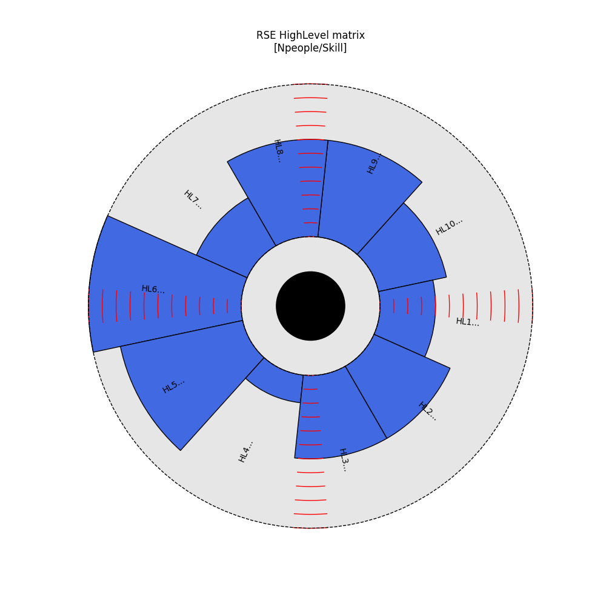
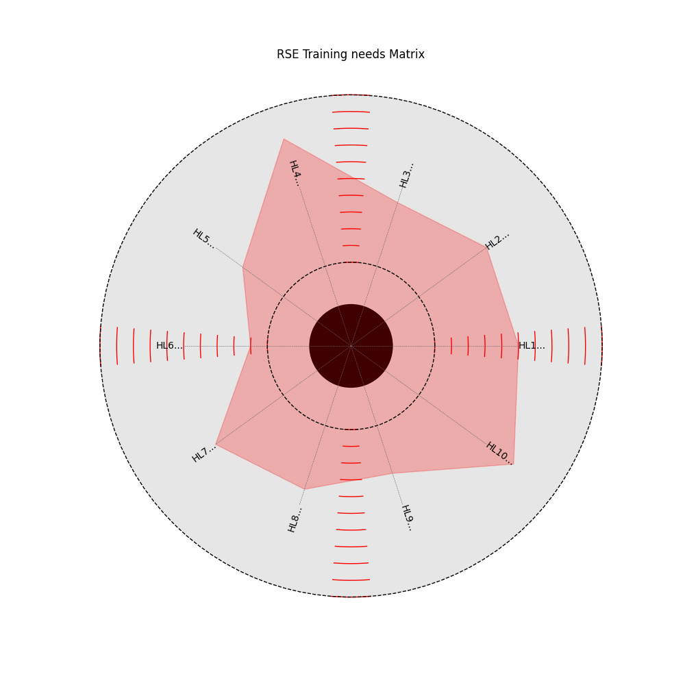
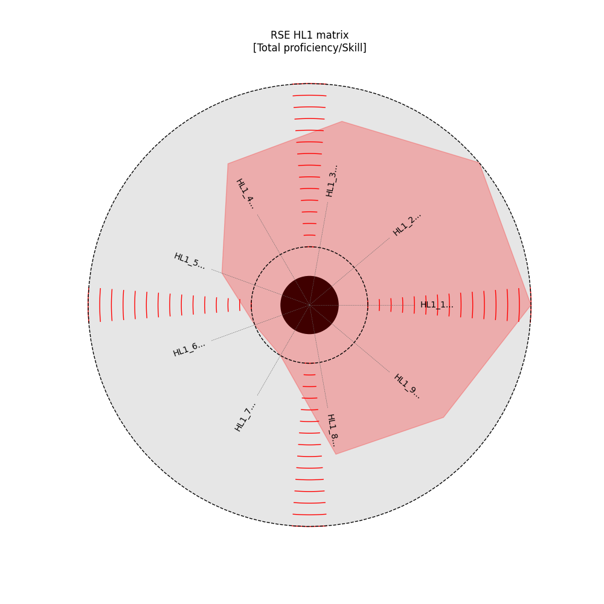
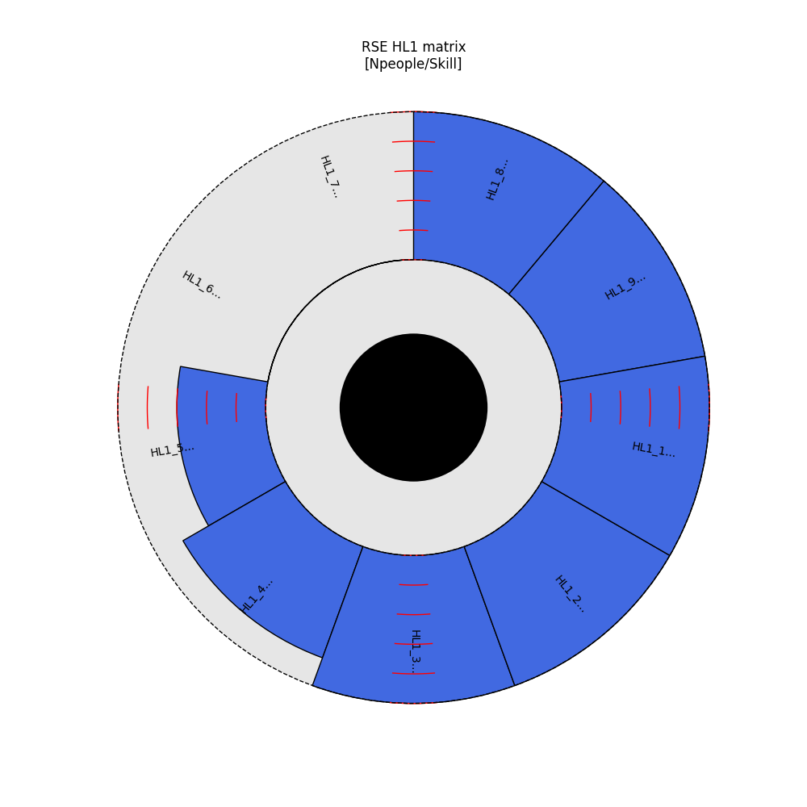

.. _Usagecli:

.. note::

   All the files used in the examples below are public and shared in the repository. They are shared in the same GPLv3 licence as the software.

How to use neo?
===============

1-The command line interface help
---------------------------------

You can start neo from a terminal. neo comes with a command line interface which includes a 'help' that you can display in your terminal using the help command. It must be called like this::

           [user@machine]$ neo --help

This command will display the help of the program::

        usage: neo [-h] [-m MATRIX] [-s] [-n NAME] [-f FIRST] [-c COLUMN] [-e RSE] [-t] [--test]

        This small program read a skills matrix and allows you to plot the skills matrices at the group and individual levels

        options:
          -h, --help            show this help message and exit
          -m MATRIX, --matrix MATRIX
                                Spreadsheet you want to open
          -s, --sheets          List all sheets available in the file
          -n NAME, --name NAME  Name of the sheet (sub skill matrix) to consider
          -f FIRST, --first FIRST
                                First row of the matrix in the spreadsheet
          -c COLUMN, --column COLUMN
                                Letter of the Skill column
          -e RSE, --rse RSE     Name of the rse to plot the skill matrix for
          -t, --training
          --test                Run the test suite

Neo can be started with few different arguments. If you start neo without any arguments you will get the following message ::

        [user@machine]:$ neo
        [Skills Matrix Generation] :No spreadsheet was given....exit...

We explain the other arguments below

2-Giving a Matrix
-----------------

The argument '--matrix' [or the shorter version '-m'] is where you feed Neo with your matrix file. To know how what kind of file you should give please have a look at :doc:`input`.

3-Sheets
--------

The argument '-s' or '-/-sheet' allows you to have a list of sheets in the spreadsheet. Example::

        user@machine:$ neo -m Fake_SkillsInterestMatrix.xlsx --sheets
        [Neo: Matrix Generation:] : Spreadsheet found...start analysis...
        [Neo: Matrix Generation:] : Open file...
        [Neo: List sheets] : Extracting sheets...
        [Neo: List sheets] : HighLevel
        [Neo: List sheets] : HL4
        [Neo: List sheets] : HL3
        [Neo: List sheets] : HL2
        [Neo: List sheets] : HL1
        [Neo: List sheets] : Topics
        [Neo: Matrix Generation:] : End of request

4-HighLevel skill matrix
------------------------

In the default file format, the first sheet is the HighLevel skills matrix. This is the sheet where people identify the areas where they have some knowledge.  The argument '-n' or '-/-name' allows you to extract a given submatrix and display its data. So for the HighLevel matrix you will need to write::

        user@machine:$ neo -m Fake_SkillsInterestMatrix.xlsx -n HighLevel
        

Note that in the default file format, the HighLevel skill matrix starts at line 13 hence you will have to precise the first line (by default it is setup at Line 2, like for other subsills matrix)::

        user@machine:$ neo -m Fake_SkillsInterestMatrix.xlsx -n HighLevel -f 13

This will display the genera skills matrix as a circular barplot. For each HighLevel skill area, you will have a bar whose height corresponds to the number of people who answered 'YES' to that skill.

   High Level Skill matrix

5-Training matrix
-----------------

The use of the '--training' argument will allow you to display the training matrix. It is a spider plot. For each skills, the value of the spider plot represent the number of people who said 'No, but interested' in the High Level skills matrix.

An example is given below:

   Training skills Matrix

6-Plot sub-matrix
-----------------

The argument '-n' or '-/-name' allows you to extract a given submatrix and display its data::

        user@machine:$ neo -m Fake_SkillsInterestMatrix.xlsx -n HL1
        [Neo: Matrix Generation:] : Spreadsheet found...start analysis...
        [Neo: Matrix Generation:] : Extracting HL1 matrix
        [Neo: Matrix Generation:] : End of request

This will give the following two plots:

   Subskill Matrix - Tota proficiency per skill

This first plot gives the total team proficiency for each skill. As shown in :doc:`input`, the maximum profiency for a given skill is 3. Hence, the total proficiency for a given skill is the number of people in the sub-skills matrix multiplied by three.

   Subskill Matrix - NPeople/skill

The second plot gives the number of people with a proficiency at least equal to 1 per skills. It allows to see how many people have some knowledge about a given skill.

If the name of the matrix you want to display does not correspond to any of the sheets in the file you have given you will get a message and the program will quit::

        usaer@machine:$ neo -m Fake_SkillsInterestMatrix.xlsx -n HL19
        [Neo: Matrix Generation:] : Spreadsheet found...start analysis...
        [Neo: Matrix Generation:] : Extracting HL19 matrix
        [Neo: Matrix Generation:] : Matrix HL19 not found...exit...
        [Neo: Matrix Generation:] : End of request

.. warning::

        It is assumed that the submatrix starts at the line #2 of the sheet. This is why the argument '-f' or '-/-first' has a default value of 2. If that is not the case, you have to precise the first line of the spreadsheet (the one with RSEnames).

.. warning::

        It is also assumed that the submatrix column with the skills name is the column A. You can give another one by using the  '-c' or '-/-column' argument. 

7-Individual data
-----------------

It is possible to display individual data for a given member of the team an for a given matrix. For this you can use the '-e' argument giving::

        user@machine:$ neo -m Fake_SkillsInterestMatrix.xlsx -n HL1 -e Thor
        [Neo: Matrix Generation:] : Spreadsheet found...start analysis...
        [Neo: Matrix Generation:] : Extracting HL1 matrix
        [Neo: Matrix Generation:] : End of request

This will give a spider plot proficiency per skill:

   Subskill Matrix - For a single team member

Of course, if you try to display the skill matrix of a person that does not have data in the skill matrix, you will end up with nothing::

        user@machine:$ neo -m Fake_SkillsInterestMatrix.xlsx -n HL1 -e Thore
        [Neo: Matrix Generation:] : Spreadsheet found...start analysis...
        [Neo: Matrix Generation:] : Extracting HL1 matrix
        [Neo: Matrix Generation:] : The HL1 matrix for Thore is empty...exit...
        [Neo: Matrix Generation:] : End of request

